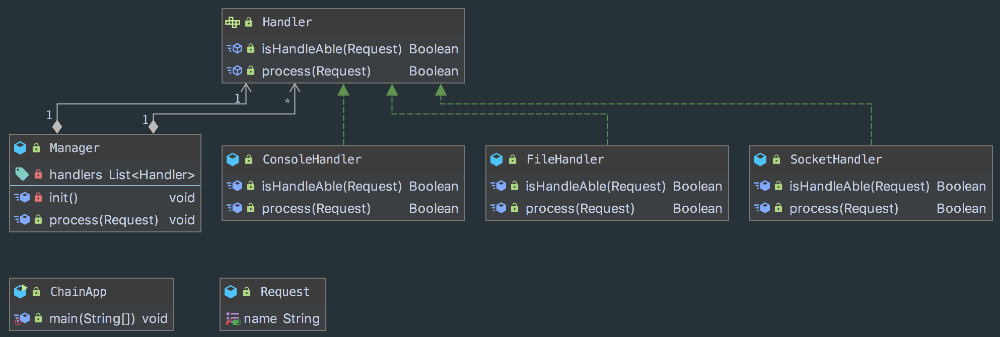

## 目的
给多个处理器一个处理请求的机会，避免请求的发送者和接收者耦合。

## 特点
- 单例类只有一个实例对象
- 该单例对象必须由单例类自行创建
- 单例类对外提供一个访问该单例的全局访问点

## 类图
角色：请求、 处理器、管理者、 客户端

## 适用场景
- 多对象可能要处理请求，并且处理器不知道哪对象优先
- 你想对多个对象之一发出请求而无需明确指定接收者
- 处理对象集合应该被动态指定时

## 例子
* [java.util.logging.Logger#log()](http://docs.oracle.com/javase/8/docs/api/java/util/logging/Logger.html#log%28java.util.logging.Level,%20java.lang.String%29)
* [javax.servlet.Filter#doFilter()](http://docs.oracle.com/javaee/7/api/javax/servlet/Filter.html#doFilter-javax.servlet.ServletRequest-javax.servlet.ServletResponse-javax.servlet.FilterChain-)

