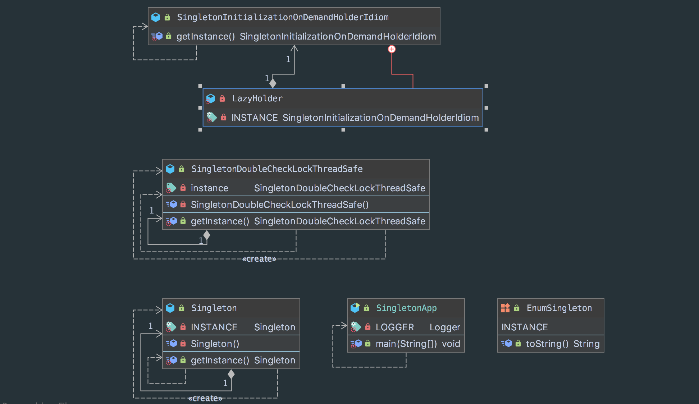

## 目的
保证一个类只有一实例，并提供全局访问点。

## 特点
- 单例类只有一个实例对象
- 该单例对象必须由单例类自行创建
- 单例类对外提供一个访问该单例的全局访问点

## 类图

## 例子
* [java.lang.Runtime#getRuntime()](http://docs.oracle.com/javase/8/docs/api/java/lang/Runtime.html#getRuntime%28%29)
* [java.lang.System#getSecurityManager()](http://docs.oracle.com/javase/8/docs/api/java/lang/System.html#getSecurityManager--)
* ServletContext、ServletContextConfig
* Spring 框架应用中的 ApplicationContext
* 数据库中的连接池

## 参考
* [Effective-Java-3rd-edition Chapter 2. Creating and Destroying Objects](https://www.amazon.com/Effective-Java-Joshua-Bloch-ebook/dp/B078H61SCH)